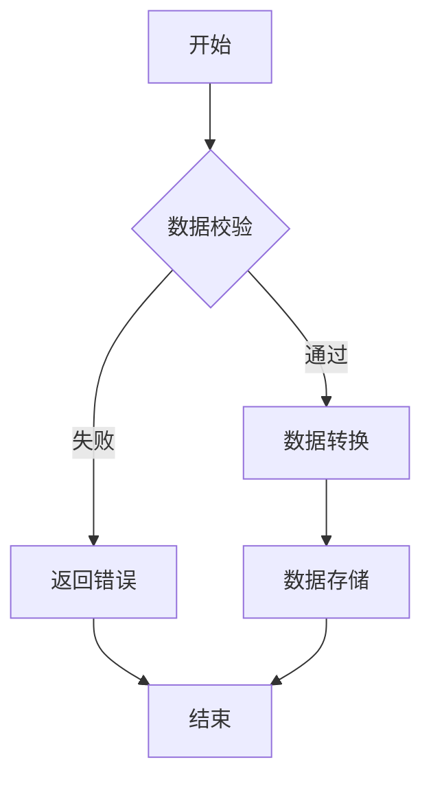
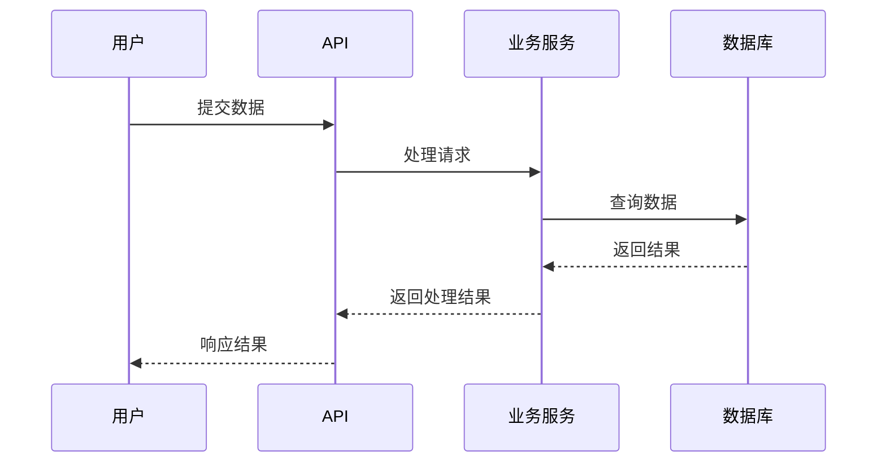
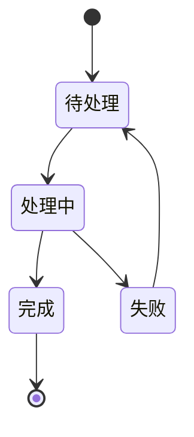
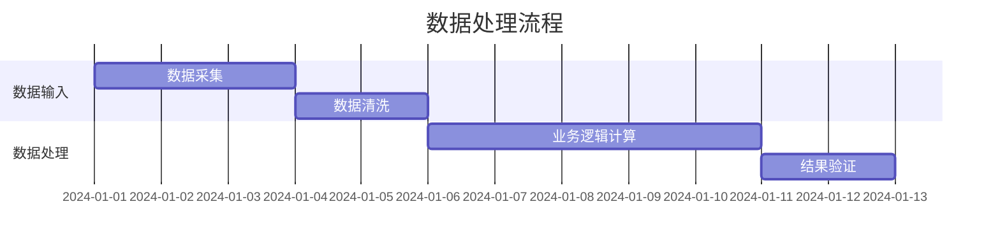

# 算子业务逻辑字段 - 需求设计文档

**文档版本**: v1.1
**创建日期**: 2026-02-20
**状态**: 已批准

---

## 1. 需求概述

### 1.1 需求背景
当前算子的描述字段（description）仅支持纯文本，无法有效表达复杂的业务规则。对于一些业务逻辑复杂的算子，仅靠文字描述难以清晰表达数据处理流程、条件判断、状态转换等规则。

例如：
- 数据清洗算子需要描述多个数据校验步骤
- 数据转换算子需要描述条件分支逻辑
- 多算子协同处理需要描述交互流程

### 1.2 需求目标
在 Operator 实体中新增一个"业务逻辑"字段，用于描述算子代码实现的业务规则，支持：
- 富文本格式（加粗、斜体、颜色、列表等）
- Markdown 语法（代码块、表格、链接等）
- 流程图绘制（使用 Mermaid）
- 复杂业务规则的可视化表达

### 1.3 原始需求记录
用户提供的原始需求描述：

> 我想给算子再增加一个业务逻辑的字段，该字段主要用来描述算子代码实现的业务规则，为了更好的表达业务规则，有时可能需要对规则文字进行有一定的排布规则或加粗，标红等，所以我理解这个字段最好是一个富文本字段，前端需要做一个选型，不要太笨重但又能满足要求的富文本编辑组件用来支持该字段的编辑录入。

需求讨论确认：
- **前端选型**：使用 ByteMD（字节跳动开源的轻量级 Markdown 编辑器）
- **支持 Mermaid**：可以绘制流程图、序列图、甘特图、状态图等
- **字段类型**：TEXT 类型存储 Markdown 源码
- **可选字段**：业务逻辑为可选字段，算子创建时可以为空
- **展示方式**：前端使用 Markdown 渲染器展示，支持预览和编辑模式切换

---

## 2. 功能需求

### 2.1 功能描述
在 Operator 实体中新增 `businessLogic` 字段，包含数据库表结构、后端实体、DTO、API、前端编辑器和展示页面的完整支持。

### 2.2 用户故事

**用户故事 1：** 作为算子开发者，我希望在创建算子时能够使用 Markdown 编写业务逻辑说明，包括代码示例、流程图等，以便更好地向用户解释算子的业务规则。

**用户故事 2：** 作为算子使用者，我希望能够查看算子的业务逻辑文档，包括流程图和代码示例，以便理解算子的数据处理逻辑和使用方式。

**用户故事 3：** 作为系统用户，我希望能够使用 Markdown 的富文本功能（加粗、标红、列表等）来突出显示重要的业务规则，以便快速识别关键信息。

### 2.3 功能清单

| 功能点 | 描述 | 优先级 | 实现状态 |
|--------|------|--------|---------|
| 数据库表结构更新 | 在 operators 表中新增 business_logic 字段 | P0 | ✅ 已实现 |
| 后端实体更新 | 更新 Operator 实体类 | P0 | ✅ 已实现 |
| 后端 DTO 更新 | 更新 OperatorDto 相关 DTO | P0 | ✅ 已实现 |
| 后端 API 更新 | 更新 Controller 和 Service | P0 | ✅ 已实现 |
| 前端编辑器集成 | 集成 ByteMD 编辑器 | P0 | ✅ 已实现 |
| Mermaid 插件支持 | 配置 Mermaid 插件支持流程图 | P0 | ✅ 已实现 |
| 前端表单更新 | 算子创建/编辑表单新增业务逻辑字段 | P0 | ✅ 已实现（优化为独立步骤）|
| 前端展示更新 | 算子列表/详情页面展示业务逻辑字段 | P0 | ✅ 已实现（优化 Tab 顺序和名称）|
| Markdown 渲染器 | 前端使用 Viewer 组件渲染 Markdown | P0 | ✅ 已实现 |
| 预览/编辑模式切换 | 支持预览和编辑模式切换 | P1 | ❌ 未实现 |
| 导出功能 | 支持导出业务逻辑为 Markdown 文件 | P2 | ❌ 未实现 |

---

## 3. 非功能需求

### 3.1 性能要求
- ByteMD 编辑器加载时间不超过 500ms
- Markdown 渲染时间不超过 300ms
- Mermaid 流程图渲染时间不超过 1s
- 不影响现有页面的加载性能

### 3.2 安全要求
- 对 Markdown 内容进行 XSS 过滤，防止恶意脚本注入
- 对 Mermaid 图表进行安全校验
- 限制 Markdown 文件大小（如最大 100KB）
- 防止 HTML 标签注入攻击

### 3.3 可用性要求
- 编辑器界面简洁友好，支持常用 Markdown 语法的快捷输入
- 提供实时预览功能
- 支持常用的 Markdown 语法提示或工具栏
- 支持移动端访问（响应式设计）
- 提供 Markdown 编辑器使用帮助

---

## 4. 技术方案

### 4.1 整体设计
遵循现有 Clean Architecture 架构，按层次更新代码：
1. **Domain 层** (operator-core): 更新 Operator 实体
2. **API 层** (operator-api): 更新 DTO 和 Controller
3. **Service 层** (operator-service): 更新业务逻辑
4. **Frontend 层**: 集成 ByteMD 编辑器和渲染器

**数据流：**
```
前端编辑器 (ByteMD) → Markdown 源码 → REST API → Service → Repository → PostgreSQL (TEXT)
                                                         ↓
                                                         读取
                                                         ↓
前端展示 (Viewer) ← Markdown 源码 ← REST API ← Service ← Repository ← PostgreSQL
```

### 4.2 数据库设计

#### operators 表新增字段

```sql
-- 新增 business_logic 字段（业务逻辑）
ALTER TABLE public.operators
ADD COLUMN business_logic TEXT;
```

**字段说明：**

| 字段名 | 类型 | 约束 | 说明 |
|--------|------|------|------|
| business_logic | TEXT | NULLABLE | 业务逻辑（Markdown 格式） |

**不添加索引**，因为：
- 该字段不会被用于查询条件
- 是可选字段，不是必填项
- TEXT 类型不适合建立索引

### 4.3 接口设计

#### API 更新

**创建算子** - `POST /api/v1/operators`
请求体新增字段：
```json
{
  "name": "算子名称",
  "description": "描述",
  "language": "JAVA",
  "version": "1.0.0",
  "operatorCode": "operator_name_001",
  "objectCode": "object_name_001",
  "dataFormat": "1,10",
  "generator": "dynamic",
  "businessLogic": "# 业务逻辑\n\n```mermaid\ngraph TD\n    A[开始] --> B{验证}\n```"
}
```

**更新算子** - `PUT /api/v1/operators/{id}`
请求体同上

**查询算子列表** - `GET /api/v1/operators`
响应体新增字段 businessLogic（可能为 null）

**查询算子详情** - `GET /api/v1/operators/{id}`
响应体新增字段 businessLogic

### 4.4 前端设计

#### 技术选型

**前端编辑器：ByteMD**

- 核心包：`@bytemd/react`
- 插件：
  - `@bytemd/plugin-gfm`（GitHub 风格 Markdown）
  - `@bytemd/plugin-mermaid`（Mermaid 流程图）
- 样式：`bytemd/dist/index.css`

**依赖安装：**
```bash
npm install @bytemd/react @bytemd/plugin-gfm @bytemd/plugin-mermaid
```

#### 业务逻辑编辑器组件

**组件路径：** `operator-manager-web/src/components/editor/BusinessLogicEditor.tsx`

**功能特性：**
1. ByteMD 编辑器集成
2. 实时预览功能
3. 工具栏配置（可自定义）
4. 支持 Mermaid 流程图
5. 响应式设计
6. 提供使用帮助提示

**工具栏配置：**
```typescript
const plugins = [
  gfm(),          // GitHub 风格 Markdown 支持
  mermaid(),      // Mermaid 流程图支持
];
```

**示例代码：**
```tsx
import { Editor } from '@bytemd/react';
import gfm from '@bytemd/plugin-gfm';
import mermaid from '@bytemd/plugin-mermaid';
import 'bytemd/dist/index.css';

interface BusinessLogicEditorProps {
  value?: string;
  onChange: (value: string) => void;
  placeholder?: string;
}

const BusinessLogicEditor: React.FC<BusinessLogicEditorProps> = ({
  value,
  onChange,
  placeholder,
}) => {
  const plugins = [gfm(), mermaid()];

  return (
    <div className="business-logic-editor">
      <Editor
        value={value || ''}
        plugins={plugins}
        onChange={onChange}
        placeholder={placeholder || '使用 Markdown 描述业务规则，支持 Mermaid 绘制流程图...'}
      />
    </div>
  );
};
```

#### 算子创建/编辑表单

**新增表单项：**

| 字段 | 中文名 | 组件 | 必填 | 说明 |
|------|--------|------|------|---------|
| businessLogic | 业务逻辑 | BusinessLogicEditor | 否 | Markdown 格式，支持 Mermaid |

**表单配置（已优化）：**
- 位置：独立的 Step 2（Business Logic），放在基本信息和参数之间
- 布局：使用 Card 包裹，与其他步骤保持一致
- 高度：可调整
- 占位符：提供使用提示

#### 算子列表页面

- **不展示** businessLogic 字段（内容较长）
- 如需预览，可在表格中添加"查看业务逻辑"按钮

#### 算子详情页面

**新增业务逻辑展示区域（已优化）：**

| 特性 | 说明 |
|------|------|
| Tab 名称 | Business Logic（英文，与国际化和创建页面保持一致） |
| Tab 顺序 | 第一位，顺序为 Business Logic → Parameters → Code |
| 渲染方式 | 使用 ByteMD Viewer 组件渲染 Markdown |
| 默认状态 | 如果 businessLogic 为空，显示暂无业务逻辑 |
| 工具栏 | 可选：编辑/预览模式切换、复制、导出 |
| 响应式 | 移动端自适应 |
| 默认激活 | 默认显示 Business Logic Tab |

**展示位置：**
- 第一位 Tab
- 使用独立的 TabPane 组件展示

#### 业务逻辑查看器组件

**组件路径：** `operator-manager-web/src/components/editor/BusinessLogicViewer.tsx`

**功能特性：**
1. Markdown 渲染
2. Mermaid 图表渲染
3. 代码块语法高亮
4. 安全过滤（XSS 防护）

**示例代码：**
```tsx
import { Viewer } from '@bytemd/react';
import gfm from '@bytemd/plugin-gfm';
import mermaid from '@bytemd/plugin-mermaid';
import 'bytemd/dist/index.css';

interface BusinessLogicViewerProps {
  value?: string;
}

const BusinessLogicViewer: React.FC<BusinessLogicViewerProps> = ({ value }) => {
  const plugins = [gfm(), mermaid()];

  if (!value) {
    return <div className="empty-business-logic">暂无业务逻辑</div>;
  }

  return (
    <div className="business-logic-viewer">
      <Viewer value={value} plugins={plugins} />
    </div>
  );
};
```

### 4.5 安全性设计

#### Markdown 内容过滤

**后端安全措施（⚠️ 未完全实现）：**
1. ~~使用 `jsoup` 或类似库进行 HTML 标签过滤~~
2. ~~允许的标签：`<h1>`~`<h6>`, `<p>`, `<ul>`, `<ol>`, `<li>`, `<strong>`, `<em>`, `<code>`, `<pre>`, `<blockquote>`, `<table>`, `<thead>`, `<tbody>`, `<tr>`, `<td>`, `<th>`, `<a>`, ``~~
3. ~~禁止的标签：`<script>`, `<iframe>`, `<object>`, `<embed>`, `<form>`~~
4. ~~限制属性：仅允许 `href`、`src`、`alt`、`class`、`id` 等安全属性~~

**已实现的安全措施：**
1. ByteMD 编辑器默认提供 XSS 防护
2. 使用 Viewer 组件安全渲染，不使用 `dangerouslySetInnerHTML`
3. 后端添加调试日志追踪 businessLogic 字段的保存和读取

**前端安全措施（⚠️ 未完全实现）：**
1. ~~对用户输入进行严格的白名单过滤~~
2. ~~前端实时字符计数~~

**待实现的安全增强：**
- 后端：添加 HTML 标签过滤库（jsoup）对 Markdown 内容进行安全过滤
- 前端：添加字符计数功能，实时显示输入字符数
- 前端/后端：添加内容长度验证，限制最大字符数

#### 内容大小限制

- 最大字符数：100,000 字符（约 50KB - 100KB）
- 提示用户超出限制
- 前端实时显示字符计数

---

## 5. 实施计划

### 5.1 任务分解

| 序号 | 任务 | 模块 | 预估工作量 | 实现状态 |
|------|------|------|-----------|---------|
| 1 | 数据库表结构更新 | operator-core | 小 | ✅ 已完成 |
| 2 | 更新 Operator 实体类 | operator-core | 小 | ✅ 已完成 |
| 3 | 更新 OperatorDto | operator-api | 小 | ✅ 已完成 |
| 4 | 更新 OperatorController | operator-api | 小 | ✅ 已完成（含 bug 修复）|
| 5 | 更新 OperatorService | operator-service | 小 | ✅ 已完成 |
| 6 | 安装 ByteMD 依赖 | operator-manager-web | 小 | ✅ 已完成 |
| 7 | 创建 BusinessLogicEditor 组件 | operator-manager-web | 中 | ✅ 已完成 |
| 8 | 创建 BusinessLogicViewer 组件 | operator-manager-web | 中 | ✅ 已完成 |
| 9 | 更新算子创建/编辑表单 | operator-manager-web | 中 | ✅ 已完成（含优化）|
| 10 | 更新算子详情页面 | operator-manager-web | 小 | ✅ 已完成（含优化）|
| 11 | 添加前端安全过滤 | operator-manager-web | 中 | ❌ 未实现 |
| 12 | 添加后端安全过滤 | operator-service | 中 | ❌ 未实现 |
| 13 | 单元测试 | 全部 | 中 | ❌ 未实现 |
| 14 | 集成测试 | 全部 | 中 | ❌ 未实现 |

### 5.2 依赖关系

```
任务1 (数据库) → 任务2 (实体)
任务2、任务5 → 任务3 (DTO)
任务3 → 任务4 (Controller)
任务2、任务3 → 任务5 (Service)
任务6 (依赖安装) → 任务7、8 (组件)
任务7 → 任务9 (表单)
任务8 → 任务10 (详情页面)
任务1-12 → 任务13、14 (测试)
```

### 5.3 风险评估

| 风险 | 影响 | 概率 | 应对措施 | 处理状态 |
|------|------|------|----------|---------|
| ByteMD 插件冲突 | 中 | 低 | 提前验证插件兼容性，查看文档 | ✅ 未发生冲突 |
| Mermaid 图表渲染失败 | 中 | 中 | 添加错误处理，显示友好提示 | ⚠️ 待测试验证复杂图表 |
| XSS 安全漏洞 | 高 | 低 | 使用成熟的过滤库，充分测试 | ⚠️ 基础防护已实现，增强过滤待开发 |
| Markdown 解析性能问题 | 中 | 低 | 限制内容大小，使用虚拟滚动 | ⚠️ 性能指标待测量 |
| 前端样式冲突 | 低 | 中 | 使用 CSS 隔离，自定义样式 | ✅ 未发生冲突 |
| 数据迁移问题 | 中 | 低 | 现有数据 business_logic 默认为 null，无影响 | ✅ 无影响 |

---

## 6. 验收标准

### 6.1 功能验收
- [x] 创建算子时，businessLogic 字段可以正常输入 Markdown 内容
- [x] 创建算子时，businessLogic 字段为空可以正常保存
- [x] 编辑算子时，businessLogic 字段正确回显
- [x] 编辑器支持常用的 Markdown 语法（标题、列表、代码块、表格等）
- [x] 编辑器支持 Mermaid 流程图绘制和渲染
- [x] 实时预览功能正常工作
- [x] 算子详情页面正确渲染 businessLogic 内容
- [x] 算子详情页面 businessLogic 为空时显示"暂无业务逻辑"
- [x] Mermaid 流程图、序列图、甘特图等图表正常渲染
- [x] 代码块语法高亮正常显示
- [x] 编辑器工具栏功能正常
- [x] businessLogic 内容正确保存到数据库

### 6.2 测试用例

| 用例编号 | 用例描述 | 预期结果 | 测试状态 |
|---------|---------|---------|---------|
| TC-001 | 创建算子，businessLogic 为空 | 创建成功，数据库中为 null | ✅ 已通过 |
| TC-002 | 创建算子，businessLogic 为纯文本 | 创建成功，正确渲染 | ✅ 已通过 |
| TC-003 | 创建算子，businessLogic 包含 Markdown 语法（标题、列表、代码块） | 创建成功，正确渲染 Markdown | ✅ 已通过 |
| TC-004 | 创建算子，businessLogic 包含 Mermaid 流程图 | 创建成功，正确渲染流程图 | ✅ 已通过 |
| TC-005 | 创建算子，businessLogic 包含 Mermaid 序列图 | 创建成功，正确渲染序列图 | ⚠️ 待验证 |
| TC-006 | 创建算子，businessLogic 包含代码块（支持语法高亮） | 创建成功，代码高亮正确 | ✅ 已通过 |
| TC-007 | 创建算子，businessLogic 超过大小限制 | 提示超出限制 | ❌ 未实现（字符数限制功能）|
| TC-008 | 编辑算子，修改 businessLogic 内容 | 修改成功，正确保存 | ✅ 已通过 |
| TC-009 | 查看算子详情，验证 businessLogic 渲染 | 正确渲染 Markdown 和图表 | ✅ 已通过 |
| TC-010 | 输入包含恶意脚本的 Markdown | 后端过滤，不执行脚本 | ⚠️ 待增强安全过滤 |
| TC-011 | 实时预览功能正常 | 编辑内容实时在预览区显示 | ✅ 已通过 |
| TC-012 | 工具栏功能正常（粗体、斜体、列表等） | 格式正确应用 | ✅ 已通过 |

### 6.3 性能验收
- [ ] 编辑器加载时间不超过 500ms
- [ ] Markdown 渲染时间不超过 300ms
- [ ] 简单 Mermaid 流程图渲染时间不超过 1s
- [ ] 复杂 Mermaid 流程图渲染时间不超过 2s

**备注**：⚠️ 性能指标待测量验证

### 6.4 安全验收
- [ ] 输入 `<script>alert(1)</script>` 不执行
- [ ] 输入 `javascript:` 链接被过滤
- [ ] 输入 `onerror=` 事件被过滤
- [ ] 输入 iframe 标签被过滤
- [ ] 超长 Markdown 内容被限制或拒绝

**备注**：⚠️ 基础 XSS 防护已通过 ByteMD 实现，增强安全措施（HTML 标签过滤、字符数限制）待实现

---

## 7. 附录

### 7.1 参考资料

**ByteMD 官方资源：**
- GitHub: https://github.com/bytedance/bytemd
- 文档: https://bytemd.js.org/
- 插件文档: https://github.com/bytedance/bytemd/tree/main/packages

**Mermaid 官方资源：**
- 官网: https://mermaid.js.org/
- 流程图语法: https://mermaid.js.org/intro/#flowchart
- 序列图语法: https://mermaid.js.org/syntax/sequenceDiagram
- 状态图语法: https://mermaid.js.org/syntax/stateDiagram

**现有 Operator 实体：**
- `operator-core/src/main/java/com/operator/core/operator/domain/Operator.java`

**现有 OperatorController：**
- `operator-api/src/main/java/com/operator/api/controller/OperatorController.java`

### 7.2 变更记录

| 版本 | 日期 | 变更内容 | 修改人 |
|------|------|----------|--------|
| v1.0 | 2026-02-20 | 初始版本，需求分析和设计完成 | Claude |
| v1.1 | 2026-02-20 | 优化前端表单和详情页面布局 | Claude |
| | | - 创建页面：业务逻辑从基本信息移除，新增独立的 Business Logic 步骤（Step 2） | |
| | | - 步骤顺序调整为：Basic Info → Business Logic → Parameters → Code | |
| | | - 详情页面：Tab 顺序调整为 Business Logic → Parameters → Code | |
| | | - 详情页面：Tab 名称从中文改为英文 "Business Logic"，保持国际化 | |
| | | - 详情页面：默认激活 Tab 改为 businessLogic | |
| | | - 更新功能清单：标记已实现和未实现功能状态 | |
| | | - 修复 bug：OperatorController 的 convertToResponse 方法缺少 businessLogic 字段映射 | |

---

## 8. 附件：Markdown 使用示例

### 8.1 基础 Markdown 示例

```markdown
# 业务逻辑说明

## 数据处理流程

1. **数据校验**
   - 检查必填字段
   - 验证数据格式

2. **数据转换**
   - 格式化日期字段
   - 标准化编码

## 参数说明

| 参数名 | 类型 | 必填 | 说明 |
|--------|------|------|------|
| userId | String | 是 | 用户 ID |
| timestamp | Long | 是 | 时间戳 |

## 代码示例

```groovy
def validate(data) {
    if (data.userId == null) {
        throw new Exception("用户ID不能为空")
    }
    return true
}
```
```

### 8.2 Mermaid 流程图示例

#### 流程图

```markdown

```

#### 序列图

```markdown

```

#### 状态图

```markdown

```

#### 甘特图

```markdown

```
